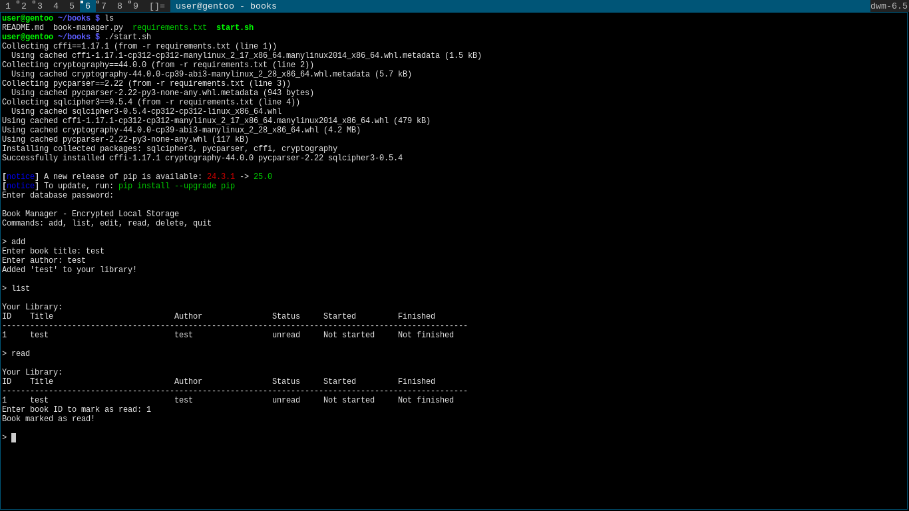
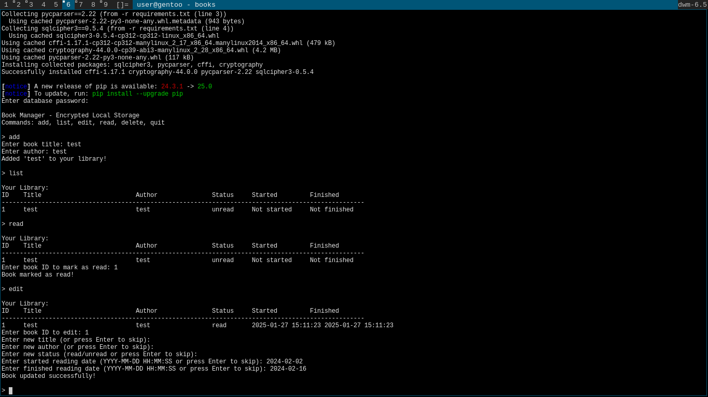

# Encrypted Books Management System

A command-line book management system with encrypted local storage using SQLCipher.

## Images:
Using the (`start.sh`) for the first time:

Editing book entry:


## Features

- Secure encrypted database storage
- Add, edit, delete and list books
- Track reading status and dates
- Command-line interface
- Database integrity verification

## Installation

1. Ensure you have Python 3.6+ installed
2. Clone this repository
3. Run the start script:

```bash 
./start.sh
```

The script will:
- Create a Python virtual environment if needed
- Install required dependencies
- Launch the book manager application

## Usage

Available commands:
- `add` - Add a new book
- `list` - Display all books
- `edit` - Edit book details
- `read` - Mark a book as read
- `delete` - Remove a book
- `quit` - Exit the application

## Database Security

- Books are stored in an encrypted SQLite database using SQLCipher

## Files

- `book-manager.py` - Main application code
- `start.sh` - Installation and launch script
- `books.db` - Encrypted database file (created on first run)
